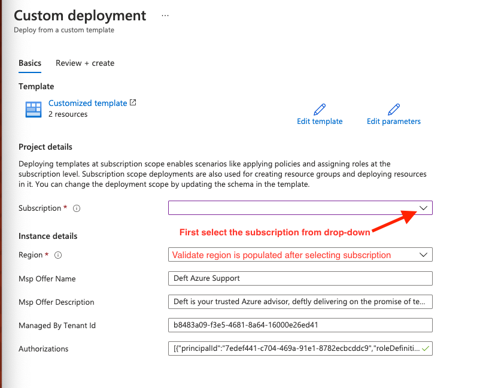

# Click this button to deploy Lighthouse template

## Description
Lorem ipsum filler text here. Customer first mover advantage gen-z release direct mailing lean startup handshake assets. Sales stealth market freemium supply chain funding. Buzz MVP first mover advantage beta. Seed round handshake strategy hackathon non-disclosure agreement return on investment equity facebook backing user experience. End of lorem ipsum filler text.

## Deployment Instructions
1. Click the _**Deploy to Azure**_ button above

2. Be sure to be signed in with an Azure AD account that has _Microsoft.Authorization/roleAssignments/write_ permissions (typically a user assigned to Owner role for the Azure subscription)

3. On the "Custom Deployment" page, select the appropriate subscription from the dropdown and then verify that the correct Region is populated

4. Click _**Review + Create**_ at the bottom of the screen

5. After automatic deployment validation is complete, click _**Create**_

## Parameters
**mspOfferName**: Deft Azure Support

**mspOfferDescription**: Deft is your trusted Azure advisor, deftly delivering on the promise of technology.

**managedByTenantId**: b8483a09-f3e5-4681-8a64-16000e26ed41

## Authorizations
Deft Authorization Display Name | Azure Built-in RBAC Role | RBAC Role ID
--- | --- | ---
Deft Read-Only Support | [Reader] | `acdd72a7-3385-48ef-bd42-f606fba81ae7`
Deft Backup Support | [Backup Operator] | `00c29273-979b-4161-815c-10b084fb9324`
Deft Operations Readers | [Log Analytics Reader] | `73c42c96-874c-492b-b04d-ab87d138a893`
Deft Operations Readers | [Azure Sentinel Reader] | `8d289c81-5878-46d4-8554-54e1e3d8b5cb`
Deft Backup Operations | [Backup Operator] | `00c29273-979b-4161-815c-10b084fb9324`
Deft Automation Operations | [Automation Operator] | `d3881f73-407a-4167-8283-e981cbba0404`
Deft Cost Management | [Cost Management Contributor] | `434105ed-43f6-45c7-a02f-909b2ba83430`
Deft Tag Operations | [Tag Contributor] | `4a9ae827-6dc8-4573-8ac7-8239d42aa03f`
Deft Elevated Operations | [Contributor] | `b24988ac-6180-42a0-ab88-20f7382dd24c`
Deft Elevated Management | [Contributor] | `b24988ac-6180-42a0-ab88-20f7382dd24c`
Deft Policy Management | [Resource Policy Contributor] | `36243c78-bf99-498c-9df9-86d9f8d28608`
Deft Policy Remediation Management | [User Access Administrator]* | `18d7d88d-d35e-4fb5-a5c3-7773c20a72d9`
Deft Blueprint Management | [Blueprint Contributor] | `41077137-e803-4205-871c-5a86e6a753b4`
Deft Blueprint Assignements | [Blueprint Operator] | `437d2ced-4a38-4302-8479-ed2bcb43d090`

*_Deft Policy Remediation Management, delegated the **User Access Administrator** role, is limited to assigning managed identities the following RBAC roles ([Learn more][1])_:

Assignable Role | RBAC Role ID
--- | ---
[Log Analytics Contributor] | `92aaf0da-9dab-42b6-94a3-d43ce8d16293`
[Virtual Machine Contributor] | `9980e02c-c2be-4d73-94e8-173b1dc7cf3c`
[Backup Contributor] | `5e467623-bb1f-42f4-a55d-6e525e11384b`
[Monitoring Contributor] | `749f88d5-cbae-40b8-bcfc-e573ddc772fa`
[Security Admin] | `fb1c8493-542b-48eb-b624-b4c8fea62acd`
[Contributor] | `b24988ac-6180-42a0-ab88-20f7382dd24c`

<!-- Hyperlinks -->
[Reader]: https://docs.microsoft.com/en-us/azure/role-based-access-control/built-in-roles#reader
[Backup Operator]: https://docs.microsoft.com/en-us/azure/role-based-access-control/built-in-roles#backup-operator
[Log Analytics Reader]: https://docs.microsoft.com/en-us/azure/role-based-access-control/built-in-roles#log-analytics-reader
[Azure Sentinel Reader]: https://docs.microsoft.com/en-us/azure/role-based-access-control/built-in-roles#azure-sentinel-reader
[Automation Operator]: https://docs.microsoft.com/en-us/azure/role-based-access-control/built-in-roles#automation-operator
[Cost Management Contributor]: https://docs.microsoft.com/en-us/azure/role-based-access-control/built-in-roles#cost-management-contributor
[Tag Contributor]: https://docs.microsoft.com/en-us/azure/role-based-access-control/built-in-roles#tag-contributor
[Contributor]: https://docs.microsoft.com/en-us/azure/role-based-access-control/built-in-roles#contributor
[Resource Policy Contributor]: https://docs.microsoft.com/en-us/azure/role-based-access-control/built-in-roles#resource-policy-contributor
[User Access Administrator]: https://docs.microsoft.com/en-us/azure/role-based-access-control/built-in-roles#user-access-administrator
[Blueprint Contributor]: https://docs.microsoft.com/en-us/azure/role-based-access-control/built-in-roles#blueprint-contributor
[Blueprint Operator]: https://docs.microsoft.com/en-us/azure/role-based-access-control/built-in-roles#blueprint-operator
[Log Analytics Contributor]: https://docs.microsoft.com/en-us/azure/role-based-access-control/built-in-roles#log-analytics-contributor
[Virtual Machine Contributor]: https://docs.microsoft.com/en-us/azure/role-based-access-control/built-in-roles#virtual-machine-contributor
[Backup Contributor]: https://docs.microsoft.com/en-us/azure/role-based-access-control/built-in-roles#backup-contributor
[Monitoring Contributor]: https://docs.microsoft.com/en-us/azure/role-based-access-control/built-in-roles#monitoring-contributor
[Security Admin]: https://docs.microsoft.com/en-us/azure/role-based-access-control/built-in-roles#security-admin

[1]: https://docs.microsoft.com/en-us/azure/lighthouse/how-to/deploy-policy-remediation#create-a-user-who-can-assign-roles-to-a-managed-identity-in-the-customer-tenant